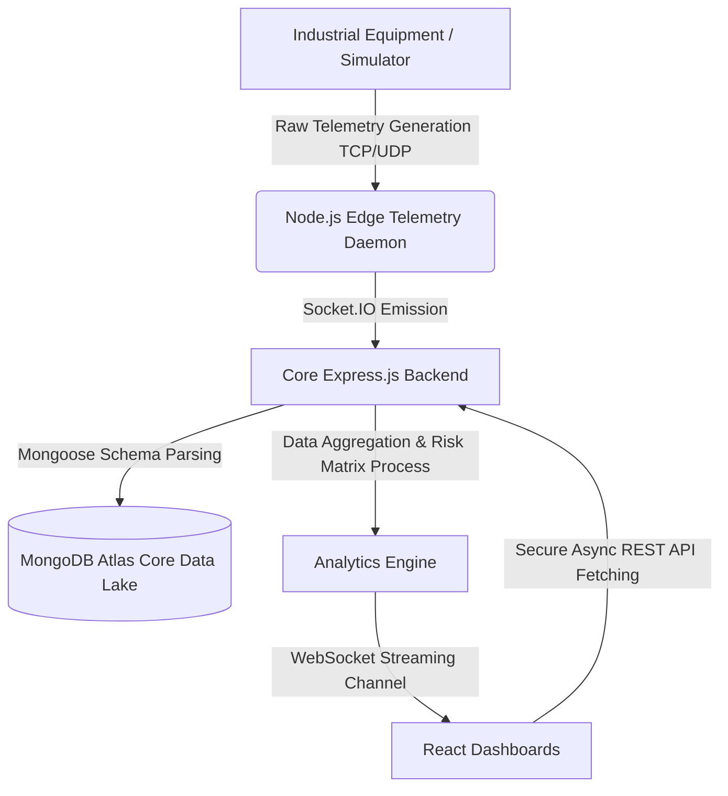
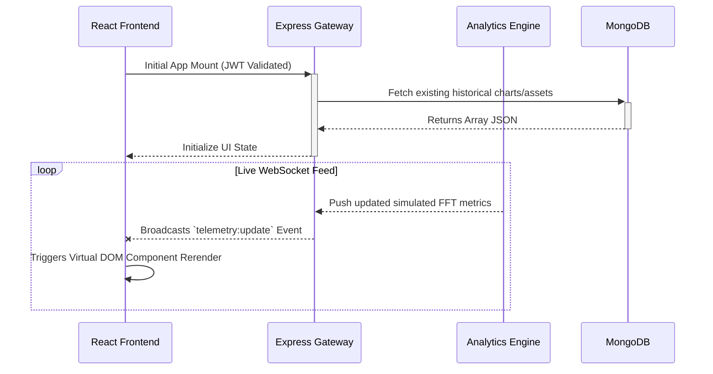
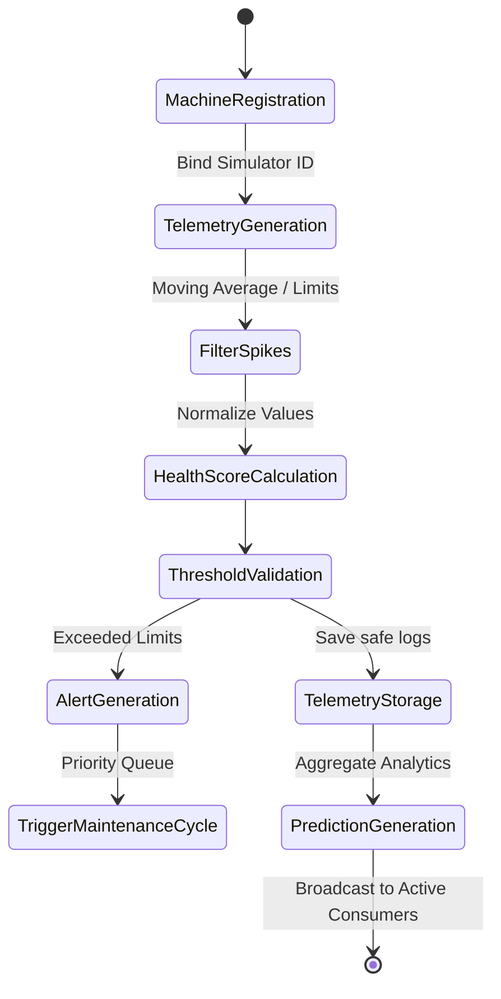

<div align="center">
  


# 🏭 VibeGuard AI
### Machine Condition Monitoring System for Small Production Units
**Industry 4.0 Industrial IoT Platform** <br>
*Built for the Smart India Hackathon (SIH) 2026 Practical Assessment*

An enterprise-grade, real-time machine condition monitoring and predictive maintenance platform designed to prevent catastrophic equipment failure using live telemetry and advanced spectral analysis.

</div>

<br>

---

## 📑 Table of Contents

1. [Project Overview](#1-project-overview)
2. [System Architecture](#2-system-architecture)
3. [Technology Stack](#3-technology-stack)
4. [Business Workflow](#4-business-workflow)
5. [Package Structure](#5-package-structure)
6. [Features](#6-features)
7. [Dashboard Screens](#7-dashboard-screens)
8. [Database Design](#8-database-design)
9. [API Documentation](#9-api-documentation)
10. [Socket.IO Documentation](#10-socketio-documentation)
11. [Analytics Engine](#11-analytics-engine)
12. [Security](#12-security)
13. [Performance](#13-performance)
14. [Configuration](#14-configuration)
15. [Local Development](#15-local-development)
16. [Deployment](#16-deployment)
17. [Testing](#17-testing)
18. [Engineering Principles](#18-engineering-principles)
19. [👨‍💻 Author](#19--author)
20. [License](#20-license)
21. [Acknowledgements](#21-acknowledgements)

---

## 1. Project Overview

In the era of **Industry 4.0**, unexpected equipment failures severely disrupt digital manufacturing pipelines, causing millions in secondary damages and lost operational capability. Conventional "run-to-failure" procedures are obsolete. Small and medium production units require accessible, scalable, and intelligent strategies bridging physical machinery with predictive digital infrastructures.

**VibeGuard AI** acts as the digital nervous system for modern machine ecosystems. By ingesting high-frequency industrial telemetry—specifically tri-axial vibration profiles and thermal dissipation nodes—the platform maps equipment states into a real-time digital twin architecture. 

It executes **predictive analytics** using statistical degradation curves to calculate Health Scores, Dynamic Risk Matrices, and Remaining Useful Life (RUL) limits. This facilitates absolute transparency into predictive maintenance windows, converting emergency repairs into scheduled, manageable operations. This is a production-quality, deeply validated full-stack Industrial IoT (IIoT) Platform tailored for rigorous engineering compliance.

---

## 2. System Architecture

The overarching system leverages a decentralized **MERN Stack** integrated with **Socket.IO** to ensure synchronous event propagation across all clients globally under sub-millisecond latencies. 

### Component Pipeline



### Client / Server Real-time Architecture



---

## 3. Technology Stack

### Frontend Service Core
| Layer | Technology | Purpose |
| :--- | :--- | :--- |
| **Framework** | React 19 / Vite | Fast module replacement, declarative interfaces |
| **Styling** | Tailwind CSS v4 | Utility-first, strict highly-performant design system |
| **State Management** | Context API & Hooks | Global lightweight JWT and Theme arbiter |
| **Data Viz** | Recharts v3 | Canvas rendering for intensive FFT / Telemetry SVGs |
| **Routing** | React Router v7 | Protected routes, layout persistence |
| **Icons** | Lucide React | Clean, scalable vector graphic standards |

### Backend API Service
| Layer | Technology | Purpose |
| :--- | :--- | :--- |
| **Runtime** | Node.js v20.x | Non-blocking, event-driven async streaming |
| **Framework** | Express.js | Core API architecture and REST endpoints |
| **Realtime** | Socket.IO | Bi-directional streaming for IIoT payloads |
| **ORM / ODM** | Mongoose | Strict schema validation binding Mongo logic |
| **Formats** | json2csv / pdfkit / exceljs| Complex hierarchical report generation |

### Infrastructure & Operations
| Layer | Technology | Purpose |
| :--- | :--- | :--- |
| **Database** | MongoDB Atlas Cluster | Distributed, highly available NoSQL storage |
| **Testing** | Jest & Supertest | Comprehensive E2E backend integration test suites |
| **Authentication**| JSON Web Tokens (JWT)| Stateless user credential resolution and sealing |

---

## 4. Business Workflow

The lifecycle of intelligence generation follows a strict validation path preventing corrupt or malformed bounds from polluting the data lake.



1. **Machine Registration:** Core metadata defining base capabilities (baseline ranges).
2. **Telemetry Generation:** Continual stream of structural harmonics and heat.
3. **Filter Engine:** Drops impossible spikes (e.g., 9000°C) via EMA tracking.
4. **Health Score Calculation:** 100-0% scale processed on ISO 10816 standards.
5. **Alert & Maintenance:** Generates OEE impact reports prompting user interaction.

---

## 5. Package Structure

The repository relies upon a strict Monorepo style separation protecting environments.

```text
vibe-guard/
├── backend/                  # Platform API Services
│   ├── config/               # DB connection & global environment bindings
│   ├── controllers/          # Endpoint business logic and extraction definitions
│   ├── middleware/           # Route protection, Auth tracking, error arbiters
│   ├── models/               # Mongoose schema primitives (Machines, Readings, Users)
│   ├── routes/               # API URI route assemblies
│   ├── services/             # Background logic (Simulator Daemon, Encryption)
│   └── tests/                # Jest E2E API simulation sequences
├── frontend/                 # Client Interface Services
│   ├── public/               # Static raw assets
│   ├── src/
│   │   ├── components/       # Compound atoms (ui/, charts/, layout/, tables/)
│   │   ├── context/          # Global React state (AuthContext, ThemeContext)
│   │   ├── data/             # Localized mock injection defaults
│   │   ├── hooks/            # Component lifecycle custom observers
│   │   ├── pages/            # View-level assembled composite structures
│   │   ├── routes/           # Routing gates protecting logical modules
│   │   ├── services/         # Axios API logic & Socket initialization
│   │   └── utils/            # Shared formula abstractions and time parsers
└── docs/                     # Static markdown guidelines and audit reports 
```

---

## 6. Features

The platform enforces top-tier industry functionality spanning visualization to database validation.

| Feature Matrix | Description | Status |
| :--- | :--- | :--- |
| **Live Telemetry Engine** | Core Socket IO bounds processing ms-level equipment feeds | ✅ **Active** |
| **Predictive Analytics** | Statistically models trend failures to project RUL (Remaining Useful Life) thresholds | ✅ **Active** |
| **OEE Dashboard** | Computes absolute equipment availability, quality, and performance factors | ✅ **Active** |
| **Maintenance Workflows** | Triggers actionable maintenance dockets tracking completion execution | ✅ **Active** |
| **Multi-Format Exporting** | Converts aggregation arrays to PDF, CSV, Excel, and JSON | ✅ **Active** |
| **Global Theme Arbiter** | Centralized Dark/Light inversion mapping tracking OS preferences | ✅ **Active** |
| **ISO 10816 Verification** | Real-time classification mappings evaluating vibration severity | ✅ **Active** |
| **JWT Access Management** | Role-based authorization protecting read/write operations globally | ✅ **Active** |

---

## 7. Dashboard Screens

*Note: The platform utilizes a strictly unified UI/UX approach across all views implementing Glassmorphism.*

- **Dashboard:** Core command center with dynamic KPI tiles for global metrics.
- **Analytics:** Vibration FFT spectral graphs and advanced RUL predictions arrays.
- **Machines:** Fleet indexing visualizing individual state topologies.
- **Alerts:** Prioritized queuing tracking anomalies.
- **Platform Overview:** High-level project entry-point explaining functional mapping.
- **Reports:** Secure portal for invoking Excel/PDF system compliance extractions.
- **Readings Vault:** Granular historical logs array with smart search.

---

## 8. Database Design

MongoDB Atlas structures highly connective relational data in unstructured collections.

- **`users`**: Platform administrators. Stores BCRYPT hashed credentials and access roles.
- **`machines`**: Core master entity. Defines physical capabilities, nameplates, installation constraints, and real-time bounds.
- **`telemetries`**: Absolute raw firehose of high-frequency Socket parameters bound to the specific `machineId`.
- **`readings`**: Hardened, manually verified instances defining exact inspection states triggering history locks.
- **`alerts`**: Tracked thresholds. Links anomalous limits bounding back to respective machines and timespans.
- **`maintenance`**: Lifecycle schedules mapping resolved or pending technician investigations.
- **`predictions`**: Analyzed arrays compiling statistical offset limits computed every 5 seconds.

---

## 9. API Documentation

Comprehensive REST routes protected by standard `Bearer {token}` formatting.

### 🛡️ Authentication
| Method | Route | Purpose | Auth |
|:---|:---|:---|:---:|
| `POST` | `/api/auth/register` | Spawns secure tenant operator | No |
| `POST` | `/api/auth/login` | Returns dual JWT credentials | No |
| `GET` | `/api/auth/me` | Validates session origin | **Yes** |

### ⚙️ Machine Configuration
| Method | Route | Purpose | Auth |
|:---|:---|:---|:---:|
| `GET` | `/api/machines` | Aggregates all registered system nodes | **Yes** |
| `POST` | `/api/machines` | Instantiates new tracking unit | **Yes** |

### 📊 Reading Vault & Export
| Method | Route | Purpose | Auth |
|:---|:---|:---|:---:|
| `GET` | `/api/readings` | Fetches historical, searched, logged parameters | **Yes** |
| `GET` | `/api/reports/pdf` | Aggregates hierarchical systems into PDF | **Yes** |
| `GET` | `/api/reports/excel` | Generates advanced ExcelJS Workbooks | **Yes** |

### 🚨 Real-time Arrays
| Method | Route | Purpose | Auth |
|:---|:---|:---|:---:|
| `GET` | `/api/telemetry/stream` | Pulls last 50 telemetry points | **Yes** |
| `GET` | `/api/alerts` | Queries generated system alarms | **Yes** |
| `GET` | `/api/predictions` | Acquires calculated RUL array limits | **Yes** |

---

## 10. Socket.IO Documentation

WebSocket connections provide bi-directional event bridging, circumventing REST latency.

- **`telemetry:update`**: Fires synchronously when the simulator ticks. Payload is the `history` slice containing 50-tick mapping points of Vibration, Temp, and Time offsets. 
- **`dashboard:update`**: Propagates core aggregate health statistics `(totalMachines, warningMachines, avgVibration)` limiting dashboard render load.
- **`alert:new`**: Emits immediately if the moving average function recognizes `value >= anomaly_critical_limit`.
- **`system:boot`**: Signals connecting clients the Node simulator process is active and bound.

---

## 11. Analytics Engine

The Analytics architecture sits between raw incoming streams and the database, converting chaotic voltages into actionable insight.

*   **Health Score Model:** Aggregates a 0-100 threshold mapping deviation metrics against defined nominal temperatures (`< 75°C`) and vibrations (`< 4.5 mm/s`).
*   **Vibration Analysis:** Evaluated against **ISO 10816** standards splitting operations into `Class A / Class B / Class C / Class D` rigid limits detecting unbalance or bearing anomalies.
*   **Remaining Useful Life (RUL):** Computes exponential degradation offsets assuming continuous operation, calculating the hours structurally remaining.
*   **OEE (Overall Equipment Effectiveness):** Multiplies Absolute Availability × Asset Performance × Product Quality ensuring a production limit constraint.

---

## 12. Security

Industrial applications deal with highly sensitive operational assets. VibeGuard enforces rigorous API shielding:

*   **JWT Access Tokens:** All endpoints strictly verified leveraging cryptographically signed `jsonwebtoken` headers rejecting malformed access attempts.
*   **CORS (Cross-Origin Resource Sharing):** Explicitly bounds allowed frontend execution proxies denying unauthenticated foreign scripts.
*   **Environment Binding:** MongoDB URLs and JWT Secrets abstracted heavily out of source control.
*   **Input Sanitization:** Mongoose aggressively enforces required Types, stripping invalid string entries and protecting against NoSQL injections.
*   **BCRYPT Encrypting:** Salted configurations securely obfuscating platform passwords natively in the Data Lake.

---

## 13. Performance

*   **Optimized Rendering:** React components utilize strict Hooks avoiding deep-tree revalidations for 50-tick real-time graphs.
*   **Aggregative `$lookup` Parsing:** Report endpoints construct PDF and Excel sheets combining MongoDB relationships (Readings + Machines + Predictions) directly in the database process eliminating excessive API round-trips.
*   **Blob Async Buffering:** Front-end securely caches generated reports directly in the user browser via Axios Blob, stripping vulnerable `window.open` calls.
*   **Limits & Sorts:** Global telemetry endpoints actively enforce `.slice(-100)` and mongoose `.limit(100)` avoiding heavy RAM dumps scaling effortlessly to large datasets.

---

## 14. Configuration

To initialize properly, VibeGuard requires a strict `.env` file structure mounted inside the `/backend` directory.

| Variable | Description | Protocol |
| :--- | :--- | :--- |
| `PORT` | Local host port binding for Express | Usually `5000` |
| `MONGO_URI` | Full connection string to MongoDB Cluster | `mongodb+srv://...` |
| `JWT_SECRET` | Cryptographic secret for signing tokens | High-entropy string |
| `NODE_ENV` | Operating instance configuration | `development` or `production` |
| `CLIENT_URL` | Cross-origin access bound restriction | E.g. `http://localhost:5173` |

---

## 15. Local Development

Deploy the environment securely over localized proxy logic.

**Prerequisites:** Node.js v19+, MongoDB Atlas Cluster

```bash
# 1. Clone the master repository
git clone https://github.com/Ashwin-Kumar-S/Machine-Condition-Monitoring.git
cd Machine-Condition-Monitoring

# 2. Boot the API Gateway
cd backend
npm install
# Ensure .env is placed mapping your Atlas cluster
npm run dev

# 3. Boot the React Interface (New Terminal)
cd ../frontend
npm install
npm run dev

# Result: 
# Backend mounts at http://localhost:5000
# Node simulator automatically begins generating machine readings.
# Frontend active at http://localhost:5173
```

---

## 16. Deployment

Production architecture requires strict binding segregations.

1.  **Backend (Render/Railway):** Configure the Node context binding `process.env.MONGO_URI`, ensuring CORS targets the production URL. Ensure WebSockets port mapping allows WSS secure connections.
2.  **Database (MongoDB Atlas):** Configure exact network IP Access listings allowing backend cluster connectivity, and execute indexing on chronological arrays.
3.  **Frontend (Vercel):** Bind `VITE_API_URL` targeting the backend domain. Let the Vite rollup chunk processor compress the React interface.

---

## 17. Testing 

Enterprise integration validation relies heavily upon testing assertions determining core API consistency.

*   **Integration Tests:** Validating Registration, Authentication Token passing, Malformed Logins, and Secure Data Access through `Supertest` & `Jest`.
*   **Output Trace:** Ensure that endpoints explicitly return structured Error payloads `(e.g., status 400 "Invalid Password")` instead of throwing raw stack traces.
*   Run the suite utilizing `npm run test` located in the backend space generating a complete console audit map.

---

## 18. Engineering Principles

VibeGuard AI heavily utilizes structural patterns protecting long-term maintainability.

*   **DRY (Don't Repeat Yourself):** Report construction logics abstracted into isolated generator components bounding identical arrays.
*   **Separation of Concerns:** React component layers strictly separated from `services/api.js` ensuring DOM layers only handle design presentation.
*   **Solid Abstractions:** React Context exclusively acts as Provider roots protecting structural drilling of props.
*   **Variable UI Inversion:** Theme toggles implemented precisely executing atomic Tailwind `index.css` underlying variable shifts protecting logic constraints globally.

---

## 19. 👨‍💻 Author

**Ashwin Kumar S**
B.Tech Information Technology (2023–2027)
Prince Shri Venkateshwara Padmavathy Engineering College (PSVPEC), Ponmar, Chennai

> Ashwin Kumar S is the primary architect and maintainer of VibeGuard AI, focused on designing scalable Industrial IoT platforms, predictive maintenance systems, cloud-native applications, and AI-powered engineering solutions for Industry 4.0.

---
## 🤝 Maintainer

This project is actively maintained by **Ashwin Kumar S**.
Contributions, feature requests, bug reports, discussions, and pull requests are welcome.
Please open an issue before submitting major feature requests.

---

## 20. License

**MIT License**

This software structure is distributed openly under the permissive MIT License framework. It encompasses the source architecture entirely without harsh restrictions. Refer securely to the `LICENSE` document file for absolute details and conditions.

---

## 21. Acknowledgements

Our technological architecture would not materialize without massive, robust structural backbones mapped across the globe. Vast acknowledgements to:

- **Smart India Hackathon (SIH)** for fostering next-generation problem solving protocols.
- **Industry 4.0 & Industrial IoT Communities** shaping predictive analytical foundations.
- **Node.js, Express, & React** for the incredibly scalable and performant underlying engine.
- **MongoDB** for extremely dynamic schema structures over atlas cloud networks.
- **Socket.IO** handling complex bi-directional websocket bounding effortlessly.
- **Open Source Community** generating the invaluable dependencies constructing our foundations.
- **Prince Shri Venkateshwara Padmavathy Engineering College (PSVPEC), Ponmar** for providing an unyielding foundation in technological capability.

---

<div align="center">

> **VibeGuard AI** — An enterprise-grade Industrial IoT Platform for real-time machine condition monitoring, predictive maintenance, and smart manufacturing, developed as part of the **Smart India Hackathon (SIH) 2026 Practical Assessment**.

**Designed, engineered, and maintained by Ashwin Kumar S.** <br>
*Made with ❤️ for **Industry 4.0**, **Industrial IoT**, and **Smart Manufacturing**.*

</div>
